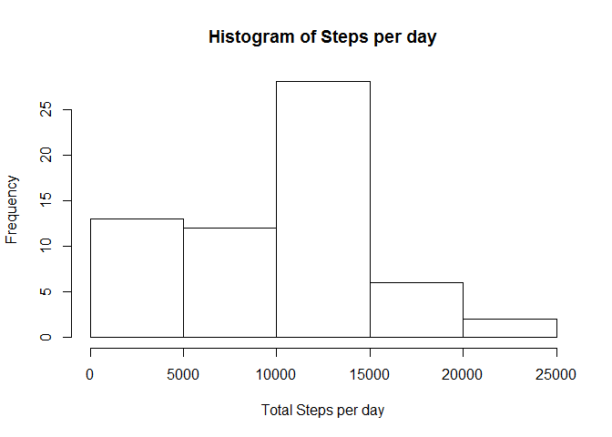
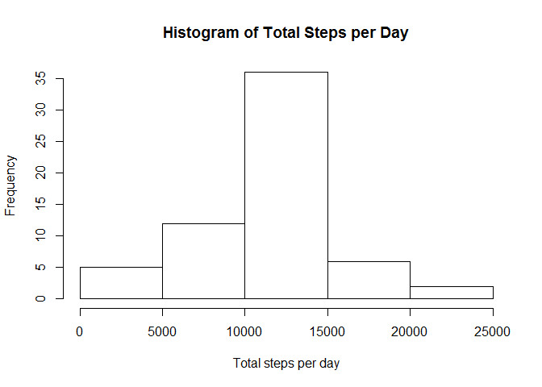

# Reproducible Research: Peer Assessment 1


## Loading and preprocessing the data

1. Load data


```r
activityData <- read.csv("activity.csv")
```

2. Transform date column from character to Date format


```r
activityData$date <- as.Date(activityData$date,'%Y-%m-%d')
```

## What is mean total number of steps taken per day?

1. Total steps taken per day


```r
totalSteps <- tapply(activityData$steps,activityData$date,sum, na.rm=T)
```

2. A Historgram showing Steps taken each day


```r
hist(totalSteps,xlab="Total Steps per day", main="Histogram of Steps per day")
```

 

3. Mean & Median of the total number of steps taken per day


```r
summary(totalSteps)
```

```
##    Min. 1st Qu.  Median    Mean 3rd Qu.    Max. 
##       0    6778   10400    9354   12810   21190
```

## What is the average daily activity pattern?

1. A time series plot of the 5-minute interval and the average number of steps taken (averaged across all days) is shown below:


```r
avg_day <- tapply(activityData$steps,activityData$interval,mean,na.rm=T)
plot(avg_day ~ unique(activityData$interval),type="l",xlab="Interval", ylab="Average Steps")
```

 

2. 5-minute interval, on average across all the days in the dataset that contains the maximum number of steps is:-


```r
avg_day[which.max(avg_day)]
```

```
##      835 
## 206.1698
```

## Imputing missing values

1. Total number of missing values in dataset is:-


```r
summary(activityData)
```

```
##      steps             date               interval     
##  Min.   :  0.00   Min.   :2012-10-01   Min.   :   0.0  
##  1st Qu.:  0.00   1st Qu.:2012-10-16   1st Qu.: 588.8  
##  Median :  0.00   Median :2012-10-31   Median :1177.5  
##  Mean   : 37.38   Mean   :2012-10-31   Mean   :1177.5  
##  3rd Qu.: 12.00   3rd Qu.:2012-11-15   3rd Qu.:1766.2  
##  Max.   :806.00   Max.   :2012-11-30   Max.   :2355.0  
##  NA's   :2304
```


NA's are in the steps variables. There are 2304 steps.

2. Fill the NAs with the average value for that 5-minute interval.


```r
newData <- activityData

for (i in 1:nrow(activityData)){
    if(is.na(newData$steps[i])){
        newData$steps[i] <- avg_day[as.character(activityData[i,"interval"])]
    }
    
}
```

3. Histogram of the total number of steps taken each day


```r
newTotalSteps <- tapply(newData$steps,newData$date,sum)
hist(newTotalSteps,xlab="Total steps per day",main="Histogram of Total Steps per Day")
```

 

Summary of the imputed data set:-


```r
summary(newTotalSteps)
```

```
##    Min. 1st Qu.  Median    Mean 3rd Qu.    Max. 
##      41    9819   10770   10770   12810   21190
```

The imputed data set values differ from the first part of the assignment. Now, the data set values is moving closer to mean values.

## Are there differences in activity patterns between weekdays and weekends?

Add a new column named day


```r
newData$day <- ifelse(weekdays(newData$date) %in% c("Saturday","Sunday"),"weekend","weekday")
```

Create subset of data for weekend and weekday for further calculation


```r
wendData <- newData[newData$day=="weekend",]
wdayData <- newData[newData$day=="weekday",]
```

Calculate the average steps taken


```r
avg_activity_weekend <- tapply(wendData$steps,wendData$interval,mean)
avg_activity_weekday <- tapply(wdayData$steps,wdayData$interval,mean)
```

Transform and combine the subset for weekend and weekday for ploting


```r
weekdayData <- data.frame(interval=unique(wdayData$interval),avg=as.numeric(avg_activity_weekday),day=rep("weekday",length(avg_activity_weekday)))
weekendData <- data.frame(interval=unique(wendData$interval),avg=as.numeric(avg_activity_weekend),day=rep("weekend",length(avg_activity_weekend)))

finalData <- rbind(weekdayData,weekendData)
```

Ploting the graph


```r
library(lattice)

xyplot(avg ~ interval | day, data = finalData, layout = c(1, 2), type = "l", ylab = "Number of steps")
```

 

There is differences between weekdays and weekend activity pattern. Weekdays has higher activity between 500 to 800 compare to weekend. Meanwhile weekend has higher activity from 1000 to 1500.
